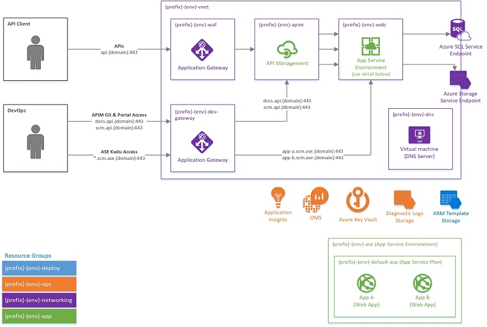

# Azure PaaS VNet Sample

This repo and these docs are a WIP. These templates will create the following setup:



## Quick Start

- Clone this repo
- `npm install`
- [Modify the config](#configuration) to suit your needs
- `npm run setup` (takes ~5 minutes)
  - See the [setup phase](#phase-1:-setup)
- `npm run deploy` (takes ~1 hour... I know I said "quick" start, but ASEs take a long time to spin up!)
- Perform the post-deployment steps
- Start deploying your code!
  - Deploy to your apps to the App Services that were created
  - Configure your API Management instance

## Configuration

The configuration for these templates and deployment processes is not your standard ARM template configuration. Instead, the configuration is housed under the [config](./config/) directory as JS files. For more details on how this configuration makes it into the ARM templates, check out the [Build Process](#build-process).

When first starting out, you will want to review the default configuration to ensure naming conventions, service SKUs, hostnames, tags, network address spaces, etc. all meet your needs. The following config files contain the default configuration:

- [default](./config/default.js): Contains base configuration, including prefix for naming conventions, base tags, and the base domain name.
- [default/app](./config/deploy/app.conf.js): Contains configuration for the shared app-level infrastructure, including the APIM and ASE.
- [default/deploy](./config/default/deploy.conf.js): Contains configuration for the infrastructure deployment process.
- [default/monitoring](./config/default/monitoring.conf.js): Contains configuration for the monitoring systems used by the rest of the infrastructure. This includes diagnostic logs retention policies.
- [default/networking](./config/default/networking.conf.js): Contains configuration for the foundational networking infrastructure, including the vnet, subnets, NSGs, and App Gateways.
- [default/secrets](./config/default/secrets.conf.js): Contains configuration for secrets storage in Key Vault.
- [default/services](./config/default/services.conf.js): Contains configuration for the individual services deployed to this infrastructure.

## Build Process

This repo makes use of Handlebars as an extra step in the build process to inject configuration into ARM templates. This may not make sense to some, given ARM's support for parameters, outputs, external parameter files, etc. However, I have my reasons, [which I've described](./docs/build-motivation.md). The short of it is that [configuration](#configuration) you've defined is available for use in your ARM templates via Handlebars. For example, in the template below, the `vnetName` parameter has a default value that is pulled from the [networking config](./config/default/networking.conf.js).

```json
{
  "parameters": {
    "vnetName": {
      "type": "string",
      "defaultValue": "{{networking.vnetName}}"
    }
  },
  ...
}
```

## Deployment Process

### Phase 1: Setup

`npm run setup`

This is the first command you'll want to run when you're setting up a new environment. This lays the foundation on which other components will be deployed. This command does the following:

- Create the resource groups (TODO: write up resource groups and descriptions)
- Create the templates storage account and container
- [Build & publish](#build-process) the templates
- Initiate an ARM deployment from these templates to create the following:
  - An OMS workspace for diagnostic logs
  - A storage account for diagnostic logs
  - An Application Insights instance to be used by App Services
  - A Key Vault to store secrets used by the infrastructure deployment processes
  - The networking foundation, including the virtual network, subnets, and NSGs
- Generate self-signed certificates in the Key Vault that will be used to configure the Application Gateways, API Management services, and App Service Environment during the Deploy phase
  - Note that these self-signed certificates should be replaced in Key Vault with certificates that have been signed by a trusted CA

Once this command has completed, you should review the following in the Azure Portal:

- IAM for each resource group that has been created
- Access Policies for the Key Vault. Users who will perform the Deploy phase will need at least "get" permissions for certificates.

### Phase 2: Deploy

`npm run deploy`

After setup has completed, this is the command that you will run to deploy the remainder of the infrastructure. It is also the command you will run if you have made updates to this infrastructure via the templates and you would like to deploy those updates. This command creates or updates the following resources via an ARM template deployment:

- An API Management service
- An App Service Environment
- An Application Gateway configured as a WAF in front of the API Management service
- An Application Gateway in front of the App Service Environment and API Management service, providing access to their Kudu endpoints
- A default App Service Plan
- App Services
  - Work Service
  - Routing Engine

### Phase 3: Post-Deployment Setup

#### Configuring SSL for your App Service Environment

After your infrastructure deployment is complete, you'll need to add an SSL certificate to your ASE. Unfortunately, there currently isn't a way to do this programmatically, so we'll do it through the portal.

1. Navigate to your ASE in the portal
2. Click on "ILB Certificate"
3. Click "Update ILB Certificate"
4. Download your ASE certificate from Azure Key Vault. The following script will download the certificate and password protect it (after prompting you for a password)
  ```
  aseCertSecretName='your cert secret name'
  keyVaultName='your key vault name'
  az keyvault secret show --name "$aseCertSecretName" --vault-name "$keyVaultName" --query value --output tsv | base64 --decode | openssl pkcs12 -nodes -passin pass: | openssl pkcs12 -export -out "$aseCertSecretName.pfx"`
  ```
5. The script will output a pfx file to your current directory. Back in the Azure portal, select this file from the file input and enter the password you used to protect the certificate.
6. Click "Upload"

#### Configuring DNS

In order for APIM to make calls to the backend ASE, we need to configure private DNS for the VNet.

**NOTE:** This is not a production-ready DNS solution. Making it production-ready would involve automated deployments and configuration management, redundancy (i.e. VM Scale Sets), monitoring, etc. Creating a production-ready DNS solution is currently not within the scope of these templates.

- In the Azure portal, create a new Windows Server 2016 VM in the "networking" resource group created as part of this deployment
- Place the VM in the "default" subnet of the vnet created as part of this deployment
- Configure your VM's NIC to use a static IP. Take note of the IP.
- RDP into your VM and add the DNS Server role (Server Manager -> Add Roles -> DNS Server)
- Server Manager -> DNS -> Right click on your server -> DNS Manager -> right click forward lookup zones -> new zone
  - Specify `ase.[your domain]` as the zone name
- Right click the newly created zone -> new host -> Enter "*" as the name and your ASE's ILB IP address
- Right click the newly created zone -> new host -> Enter "*.scm" as the name and your ASE's ILB IP address
- In your configuration file in this repo, enter the IP address of your DNS server under `networking.dnsServers`, and run `npm run deploy` to deploy the change
- Navigate to your VNet in the portal -> DNS Servers -> Custom -> Enter your DNS Server's static IP
- Navigate to your APIM instance in the portal -> Virtual network -> Apply network configuration

#### Allowing APIM to accept self-signed certificates from backends (optional)

If you are using self-signed certificates on your ASE (default), you'll need to disable certificate chain validation on your APIM service. The following PowerShell commands will configure this for you.

```
$apimRg = "Your resource group"
$apimName = "The name of your APIM service"
$aseUrl = "https://[your app service].[your ASE domain]"

$context = New-AzureRmApiManagementContext -resourcegroup $apimRg -servicename $apimName
New-AzureRmApiManagementBackend -Context  $context -Url $aseUrl -Protocol http -SkipCertificateChainValidation $true
```

## Teardown

`npm run teardown`

Deletes all resource groups creates as part of this deployment.

## Dev Access

### App Service Kudu Access
TODO

### APIM Git Repo Access
TODO

### Deploying to App Service
TODO

## Adding a new App Service
TODO

#### Allowing SCM access to the new App Service
TODO
